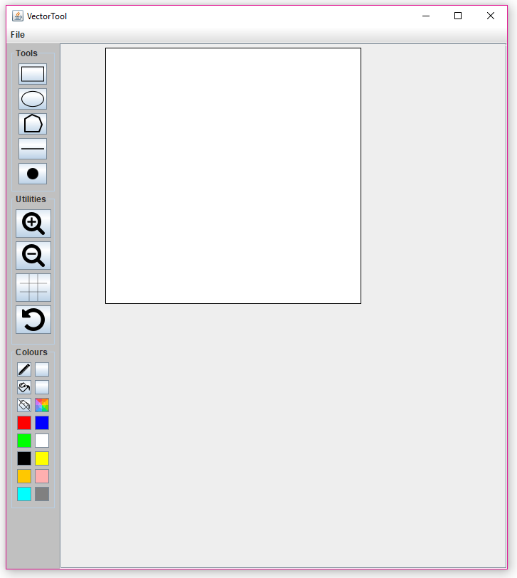

# CAB302 Assignment 2

This application is the second assessment piece for the CAB302 Unit. The task is to create a piece of Java-based software for a client (hypothetical), 
that will allow them to create and edit VEC format files. 
VEC files are just ASCII-format text files with UNIX-style line endings (that is, LF line endings). 
Each line of a VEC file describes a drawing operation. 

The image below shows the GUI. The application provides a GUI and functionality similar to Microsoft Paint. 

## Getting Started 
These instructions will get you a copy of the project up and running on your local machine for development and testing purposes.

### Prerequisite Installations
IntelliJ IDEA will be the IDE needed to run this application. Either Ultimate or Community version will work.

* [IntelliJ IDEA](https://www.jetbrains.com/idea/download/#section=windows)

### Running Application 
* Navigate to the **File** tab, then proceed to **New** -> **Project from Version Control** -> **Git**
* A new window will appear called **Clone Repository**
* Paste following URL (https://github.com/Jonathan-ol-Salazar/CAB302-Assignment-2.git) into URL section and select the Directory to save
the respository clone
* Click **Clone**
* In the **Project** toolbar, navigate to **src** -> **Main**
* Press **Ctrl** + **Shift** + **F10** to run program

## How To Use Application
For information on how to use application, please refer to the **302 Report** document, under the section **How to use Application**

## Versioning
GitHub was used for version control. 

## Software Development Process
Agile development principals were used via iteritive commit phases when implementing new features and fixing bugs. Please refer to the 
**302 Report** document, under the section **Agile Development** for more information. 

## Contributors 
Jonathan Salazar, Joshua Inglis,  Mikhayla Stephenson, Jordy Garland
